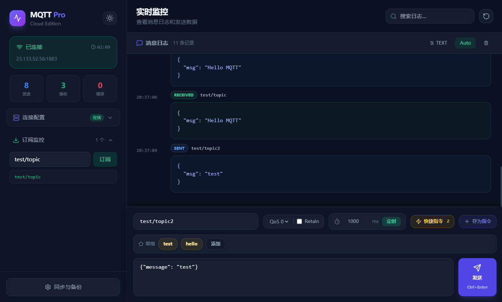
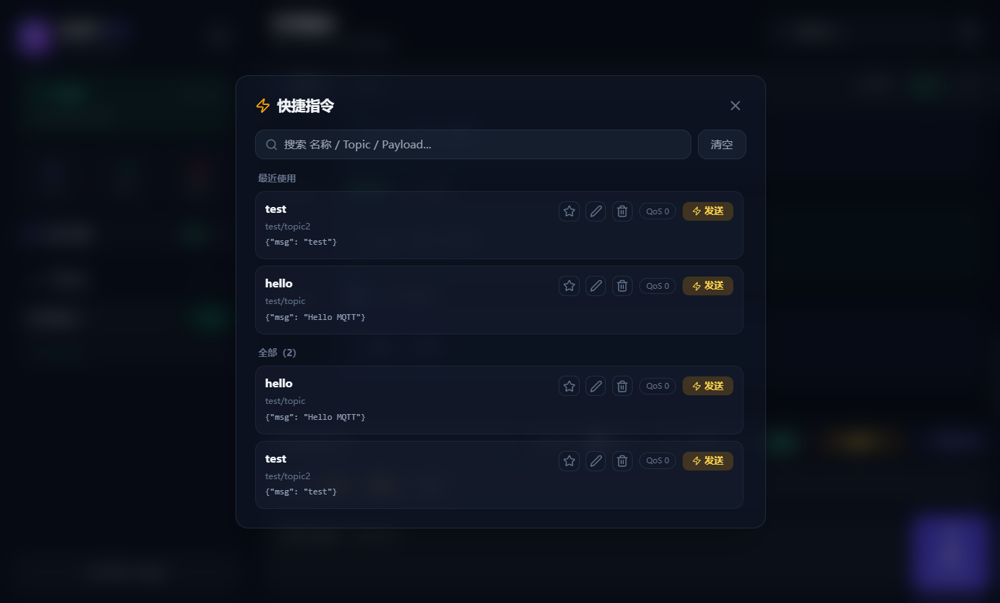
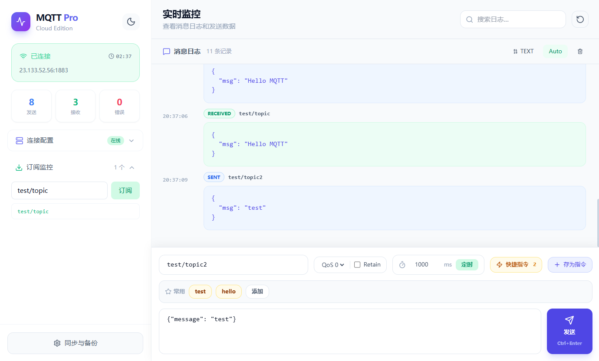

# Northrealm（北境）· MQTT 调试器 / MQTT 客户端

[](https://github.com/HaxIOX/northrealm-mqtt/releases/latest)
[](https://github.com/HaxIOX/northrealm-mqtt/actions/workflows/ci.yml)
[](LICENSE)


[English](README.md) | [简体中文](README.zh-CN.md)

简称：**NR**

面向 IoT 开发与测试的 MQTT 工具：**Web 端（浏览器）+ Windows 桌面端（Electron）**，覆盖连接、订阅、发布、日志、快捷指令与定时发送。

## 亮点

- 配置可导入/导出：一键备份，迁移/分享更省心（可选“含密码导出”，**明文**，请妥善保管）
- 快捷指令：保存常用发布，一键发送（避免反复复制粘贴）
- 双端覆盖：Web 端（`ws/wss`）+ Windows 桌面端（额外支持 `mqtt/mqtts` 直连 1883/8883）

## 功能

- 连接管理：多配置保存/切换、自动重连、连接诊断
- 本地备份：配置/快捷指令一键导入/导出（可选“含密码导出”，明文）
- 订阅/发布：QoS 0/1/2、Retain、通配符 `#`/`+`
- 日志与视图：收发实时展示、TEXT/HEX 切换
- 快捷指令：保存常用发布，一键发送

## 支持协议（Web vs Desktop）

- ☑ MQTT 协议版本：3.1 / 3.1.1 / 5.0
- ☑ WebSocket：`ws://` / `wss://`（Web & Desktop）
- ☑ TCP：`mqtt://` / `mqtts://`（仅 Desktop）

说明：

- Web（浏览器）无法直接访问原生 TCP Socket，因此 Web 端只能走 `ws/wss`

## 应用预览







## 环境要求

- Node.js：`^20.19.0 || >=22.12.0`（Vite 7 要求）

## 快速开始

- web端：[nrmqtt.haxio.de](https://nrmqtt.haxio.de/)
- 下载便携式windows客户端：[Release v0.1.3](https://github.com/HaxIOX/northrealm-mqtt/releases/tag/v0.1.3)

安装依赖（推荐 `npm ci`）。如遇 Electron 下载超时，可在 Windows CMD 中设置镜像后再执行：

```bat
set ELECTRON_MIRROR=https://npmmirror.com/mirrors/electron/
set ELECTRON_BUILDER_BINARIES_MIRROR=https://npmmirror.com/mirrors/electron-builder-binaries/
npm ci
```

Web 开发 / 构建：

```bash
npm run dev
npm run build
```

## 桌面端

```bash
# 桌面端开发：并行启动 Vite + Electron
npm run desktop:dev

# 桌面端打包（Windows）：产物输出到 release/
npm run desktop:build
```

便携版（portable）：

```bash
npm run desktop:portable
```

## 贡献

欢迎提交 Issue / PR。建议包含：复现步骤、期望行为、实际行为、截图或日志。

## 许可证

- 本项目源码采用 **GNU AGPL v3**（`AGPL-3.0-only`），详见 `LICENSE`

