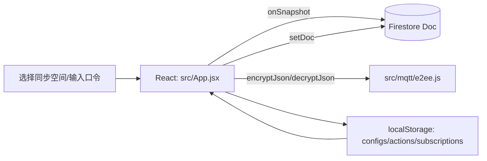

# Northrealm MQTT 项目掌握指南（学习向）

本文件用于帮助你“从 0 到能讲清楚它怎么跑”，不涉及任何代码改动建议（重构/优化另开迭代）。

## 1. 这是什么项目

Northrealm（NR）是一个 MQTT 调试器 / 客户端：

- Web 端：Vite + React（浏览器运行）
- Windows 桌面端：Electron（同一套前端 UI + 桌面壳）

核心差异：**桌面端可以使用 Node 环境加载 `mqtt` 库，从而支持 `mqtt://` / `mqtts://`（1883/8883）**；浏览器端通常只能使用 `ws://` / `wss://`（WebSocket）。

## 2. 目录结构（你应该优先看的文件）

- `index.html`：应用入口 HTML
- `src/main.jsx`：React 渲染入口，直接挂载 `App`
- `src/App.jsx`：主应用（当前几乎所有业务/UI 都在这里）
- `src/mqtt/runtime.js`：运行时探测（是否 Electron/是否 preload 注入成功）
- `src/mqtt/e2ee.js`：云同步可选加密（PBKDF2 + AES-GCM 的 envelope）
- `electron/main.cjs`：Electron 主进程，创建窗口并加载页面
- `electron/preload.cjs`：preload 脚本，尝试 `require('mqtt')` 并注入到 `window`
- `scripts/electron-dev.cjs`：开发模式下启动 Electron，并等待 Vite dev server

## 3. 启动方式与“运行时分岔”

### 3.1 Web（浏览器）

- 启动：`npm run dev`
- 特性：通常只建议连接 `ws/wss`（WebSocket 端口，如 8083/8084），不具备原生 TCP 能力。

### 3.2 Desktop（Electron）

- 启动：`npm run desktop:dev`（并行启动 Vite + Electron）
- Electron 主进程会读取 `VITE_DEV_SERVER_URL` 来加载页面（见 `electron/main.cjs`）
- preload 会尝试加载 `mqtt` 模块并注入 `window.mqtt`（见 `electron/preload.cjs`）

结论：同一个 UI，在桌面端可能走 “native mqtt（TCP/TLS）”，在 Web 端会走 “bundled mqtt（WebSocket）”。

## 4. 关键全局字段（用于诊断 Desktop 能力）

preload 与 main 进程会向 `window` 注入一些诊断字段，前端会读取并输出到日志（见 `src/App.jsx` 中的“诊断”相关日志输出）。

常见字段（名字以 `__MQTT_PRO_` 开头）：

- `window.__MQTT_PRO_DESKTOP__`：preload 是否执行过
- `window.__MQTT_PRO_MAIN_INFO__`：主进程注入的环境信息
- `window.__MQTT_PRO_MQTT_SOURCE__`：mqtt SDK 来源（例如 `native` / `bundled` / `missing`）
- `window.__MQTT_PRO_MQTT_VERSION__`：mqtt 版本信息（尽力获取）
- `window.__MQTT_PRO_DESKTOP_PRELOAD_ERROR__`：preload 加载失败的友好提示

## 5. 核心业务数据流（看懂就能掌控 80%）

### 5.1 连接与协议能力选择

在 `src/App.jsx` 的初始化逻辑中，会优先检测：

1) 桌面端是否已由 preload 注入 `window.mqtt`（native，支持 TCP）
2) 否则动态 `import('mqtt')`（bundled，浏览器版，通常只支持 ws/wss）

### 5.2 MQTT 事件流（连接 -> 订阅 -> 收消息 -> 渲染）

```mermaid
flowchart LR
  UI[UI: 点击连接/订阅/发布] --> App[React: src/App.jsx]
  App -->|connect(url, opts)| MqttClient[mqtt client instance]
  MqttClient -->|on connect| App
  MqttClient -->|on message(topic,payload)| App
  App -->|addLog / setState| State[React state]
  State --> UI
```

要点：

- 日志通常通过 `addLog(...)` 进入状态，并被限制长度（避免无限增长）。
- 订阅列表会影响 topic 过滤（只显示匹配的消息）。

### 5.3 云同步（Firebase/Firestore，可选）



要点：

- 云同步依赖全局注入的 `__firebase_config`（缺失则自动降级为纯本地模式）。
- 若启用加密：写入 Firestore 的 payload 会被封装为加密 envelope；口令存在 sessionStorage（可选记住）。

## 6. 本地持久化（你改任何功能都绕不开）

前端大量使用 `localStorage` 保存用户数据与偏好。常见 key（以实际源码为准）：

- `mqtt_configs`：连接配置列表
- `mqtt_quick_actions`：快捷动作/常用发布
- `mqtt_subscriptions`：订阅列表
- `mqtt_recent_actions`：最近使用的动作
- `mqtt_log_topic_filters`：日志 topic 过滤器
- `mqtt_theme`：主题
- `mqtt_auto_reconnect`：自动重连开关
- `mqtt_debug_packet_log`：是否记录 packet 调试日志
- `mqtt_sync_id`：云同步空间 ID（最后一次）
- `mqtt_sync_encrypt`：云同步加密开关
- `mqtt_dev_mode`：开发模式开关（某些诊断输出/行为会不同）

## 7. 推荐阅读路线（按顺序读，避免迷路）

1) `index.html` -> `src/main.jsx`：确认入口只做渲染，不藏逻辑
2) `src/mqtt/runtime.js`：先搞清楚“如何判断桌面端能力”
3) `electron/main.cjs`：了解 Desktop 是怎么加载前端页面的
4) `electron/preload.cjs`：了解 `window.mqtt` 与诊断字段从哪来
5) `src/mqtt/e2ee.js`：了解云同步加密 envelope 的结构
6) 最后再看 `src/App.jsx`：
   - 先找“初始化（加载 mqtt / 读 localStorage / Firebase 初始化）”
   - 再找“连接/订阅/发布/消息回调”
   - 再看“日志过滤与 UI 渲染”

## 8. 你可能立刻遇到的阅读障碍（已知问题）

当前仓库里有多处中文显示为乱码（注释/字符串/README）。这通常是文件编码不一致导致的；在进入深入阅读/重构前，建议先统一为 UTF-8（无 BOM），否则搜索与理解会持续被干扰。

